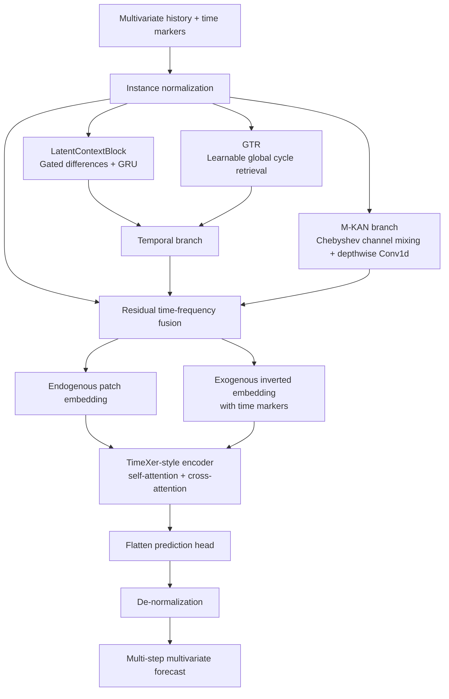
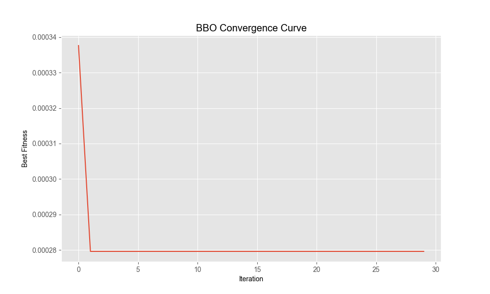

# TwinScope

**A time–frequency and endogenous–exogenous collaborative forecasting prototype**

TwinScope is a PyTorch research implementation for multivariate time-series forecasting. It combines local temporal dynamics, learnable global cyclic retrieval, an M-KAN feature branch, and TimeXer-style endogenous–exogenous interaction in one forecasting pipeline.

> 中文简介：TwinScope 面向多变量时间序列预测，在统一框架中联合建模局部动态、全局周期、非线性频率响应以及内生—外生变量交互。仓库保留原始研究代码的 `models / layers / utils / data` 组织方式，便于复现实验和开展消融研究。

## Highlights

- **Local temporal dynamics:** a gated difference representation and GRU-based latent-context block model short-term changes.
- **Global cyclic retrieval:** GTR maintains a learnable cycle table and retrieves a cyclic context for the current window.
- **M-KAN feature branch:** Chebyshev-polynomial channel mixing and depthwise temporal convolution provide a complementary nonlinear representation.
- **Time–frequency collaboration:** the temporal and M-KAN branches are fused with the normalized input through residual addition.
- **Endogenous–exogenous interaction:** a TimeXer-style encoder patches the target/endogenous series and uses the remaining variables and time markers as cross-attention context.

## Architecture

The diagram below follows the implementation in `models/LD_GTRMKANTimeXer.py`.



The model keeps the forecasting interface used by the source implementation:

```python
model(x_enc, x_mark_enc, x_dec, x_mark_dec, mask=None)
```

For `features='M'`, the returned tensor has shape `[batch, pred_len, variables]`. The training script evaluates the last column, so the prediction target must be the final non-date column.

## Repository layout

```text
TwinScope/
├── data/
│   ├── test_data_多变量.csv
│   └── 德安土负荷数据.csv
├── layers/                         # attention, embedding, RevIN and PatchTST utilities
├── models/
│   ├── LD_GTRMKANTimeXer.py        # full TwinScope model
│   ├── GTRMKANTimeXer.py           # GTR + M-KAN + TimeXer
│   ├── GTRTimeXer.py               # GTR + TimeXer ablation
│   ├── MKAN_TimeXer.py              # M-KAN + TimeXer ablation
│   ├── GTR.py
│   └── TimeXer.py
├── utils/                          # preprocessing, time features and metrics
├── LDGTR+MKAN+TimeXer.py           # main experiment entry point
├── GTR+MKAN+TimeXer.py
├── GTR.py
├── 消融-GTRTimeXer.py
├── 消融-TimeXer.py
├── 真实值与预测值.csv               # bundled example output
└── 迭代曲线图.png                   # bundled BBO search trace
```

## Data

The bundled CSV files use chronological timestamps and place `Target` last.

| File | Columns | Intended use |
| --- | --- | --- |
| `data/test_data_多变量.csv` | `date`, `Co-IMF1`–`Co-IMF4`, `Target` | Default input used by the main scripts |
| `data/德安土负荷数据.csv` | `date`, `Temperature`, `Humidity`, `WindSpeed`, `GeneralDiffuseFlows`, `DiffuseFlows`, `Target` | Example load-forecasting data |

To use another dataset, keep a parseable `date` column, place the target in the last feature column, and update the CSV path and sampling frequency in the selected entry script. The current default uses minutely time features (`freq='T'`) and a chronological 80/20 train/test split.

## Installation

Python 3.9 or newer is recommended. Create an isolated environment and install the dependencies:

```powershell
python -m venv .venv
.\.venv\Scripts\Activate.ps1
python -m pip install --upgrade pip
pip install -r requirements.txt
```

Install the appropriate PyTorch build for your CUDA version if GPU acceleration is required; otherwise the scripts automatically fall back to CPU.

## Run

Run commands from the repository root so the relative data paths resolve correctly.

```powershell
python "LDGTR+MKAN+TimeXer.py"
```

Other included entry points are:

| Script | Configuration represented by the source |
| --- | --- |
| `GTR+MKAN+TimeXer.py` | GTR + M-KAN + TimeXer |
| `GTR.py` | GTR baseline |
| `消融-GTRTimeXer.py` | GTR + TimeXer ablation |
| `消融-TimeXer.py` | TimeXer ablation |

The full-model entry point currently uses the following defaults:

| Setting | Value |
| --- | ---: |
| Input length | 10 |
| Prediction length | 1 |
| Batch size | 64 |
| Epochs | 100 |
| Learning rate | 0.001 |
| Model dimension | 64 |
| Attention heads / encoder layers | 8 / 2 |
| Feed-forward dimension | 64 |
| Patch length | 7 |
| Cycle length | 8 |

After training, the script prints `R2`, `MSE`, `MAE`, and `MAPE`, plots predictions against observations, and writes `真实值与预测值.csv`.

## Bundled search trace

The following image is the BBO convergence curve supplied with the source package. It records a hyperparameter-search trace and is not, by itself, a comparison against other forecasting models.



## Reproducibility notes

- The supplied scripts do not fix all random seeds; repeated runs can therefore differ.
- The main script fits `MinMaxScaler` before the chronological split, matching the supplied source but potentially introducing evaluation leakage. For strict benchmark reporting, fit preprocessing only on the training interval.
- GTR cycle positions are sampled with `torch.randint` inside the current forward pass. Set and control PyTorch RNG state when deterministic comparison is required.
- This repository is a research prototype. Validate data splitting, normalization, inverse transforms, and metric definitions for the target application before drawing conclusions.

## References

- **GTR:** [Beyond the Visible: Global Temporal Retrieval for Time Series Forecasting](https://arxiv.org/abs/2602.10847)
- **TimeXer:** [TimeXer: Empowering Transformers for Time Series Forecasting with Exogenous Variables](https://arxiv.org/abs/2402.19072)
- **BBO:** *Beaver Behavior Optimizer: A Novel Metaheuristic Algorithm for Solar PV Parameter Identification and Engineering Problems*.

This repository includes adapted research components. Please cite the corresponding papers when using them in academic work.

## License

No open-source license is currently granted. The code is published for inspection and research discussion; contact the repository owner before redistribution or commercial use.
